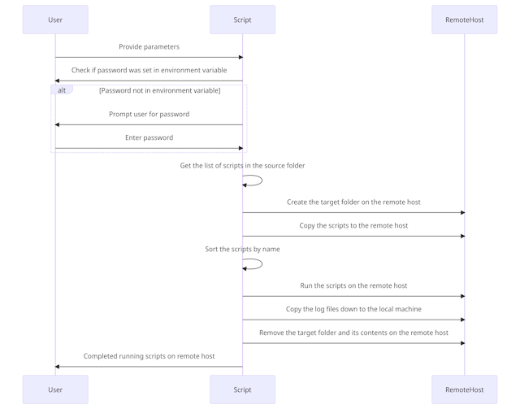

# linux-automation

Linux Automation over SSH allows remote deployment and configuration of headless Linux VM.

The solution has been developed and tested on Raspberry Pi and Ubuntu VMs. The intended use of this solution is for creation of development servers. Don't use in production without storing all secure passwords correctly.

## Overview

This script provides a solution for remotely executing shell scripts stored in a local directory. The scripts are sorted by name, then executed sequentially on a remote server over SSH. The output of each script is captured in a corresponding log file on the remote server, and then those log files are transferred back to a local directory for further analysis.

## How it Works



The steps are as follows:

1. The SSH Key is defined.
2. The script checks if an SSH password exists as an environment variable.
3. If it exists, the password is decoded from base64 to plain text. If not, the script prompts the user to enter a password, converts it to a base64 string, and stores it as an environment variable.
4. It fetches the list of script files in the specified local source directory.
5. It creates a target directory on the remote host (if it doesn't already exist).
6. It copies the script files to the target directory on the remote host using `scp`.
7. The script files are sorted by name.
8. Each script is run on the remote host in order, with output redirected to a corresponding log file.
9. Log files are transferred back to the specified local directory.
10. The target folder on the remote server is then deleted.

## Parameters

The script takes the following parameters:

- `username`: The username to use for SSH login.
- `remoteHost`: The hostname or IP address of the remote host.
- `port`: The port number for the SSH connection.
- `sourceFolderPath`: The local directory containing the scripts to be executed.
- `logFolderPath`: The local directory where the log files will be stored after execution.
- `targetFolderPath`: The directory on the remote host where the scripts will be copied and executed.

## Usage

The scripts located in the folder Setup are designed to help create an SSH key on local machine and install them on the remote SSH client. Additional script allows for storing of a SSH password as a base64 encode (not encrypted) password in an environment variable to help with automation. This method could be used in a pipeline to help with automation while not storing a persistent variable. Recommendation is to replace this with your secure method.

```powershell
.\setup-SSHKeyLogin.ps1 -username "username" -remoteHost "hostname" -port "port"

.\setup-EnvPassword.ps1 -password "username"
```

Use the following command to run the script, replacing the placeholder text with appropriate values:

```powershell
.\run-remote.ps1 -username "username" -remoteHost "hostname" -port "port" -sourceFolderPath "path_to_source" -logFolderPath "path_to_logs" -targetFolderPath "path_to_target_on_remote"
```

## Structure

The structure of the solution includes examples for Linux configuration. Under the configuration folder there are scripts to configure, SSH Login Banner, NeoFetch, PowerShell, Azure Cli and Docker. The Setup folder is for creating your SSH keys. Logs is just a area to save your logs and is ignored in the gitignore file.

A small bonus is Azure CLI. Testing was done on Raspberry PI 4 with Ubuntu 32bit. To allow Azure CLI to run, it requires a custom build which I have included ARMhf folder.

```bash markdown-tree
│
├── Assets
│
├── Configuration
│   ├── ARM
│   ├── ARMhf
│   │   └── AzCLI
│   │       └── binaries
│   └── Kali
│
├── Logs
├── Setup
└── Test
```

### Note

The script currently supports .sh script files. Also, it assumes you have SSH access to the remote host using a private key (id_rsa) located in your .ssh directory.

Please be aware that storing passwords in scripts, even in encoded format, presents security risks. Use this method with caution and consider other methods of authentication (like SSH Keys) if possible.

## Dependencies

This script requires an SSH client on the local machine to make connections and transfer files. On Unix-like systems, OpenSSH is typically installed by default.
